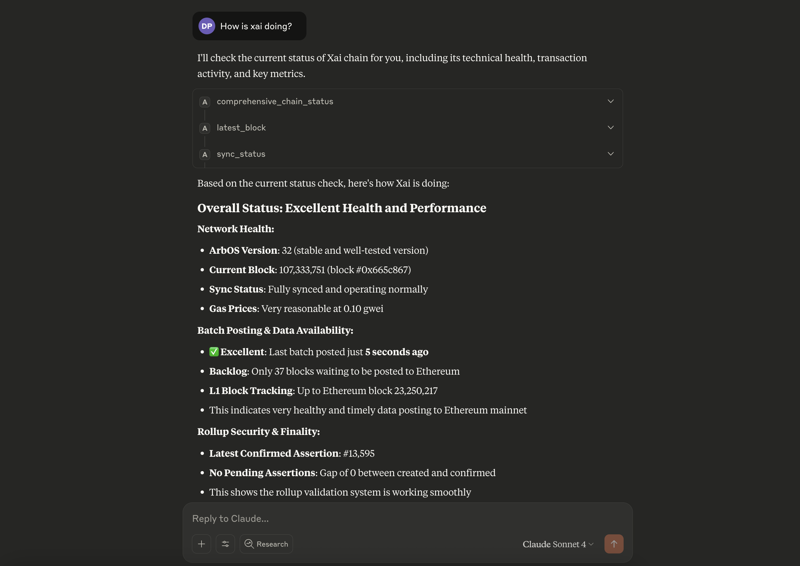

# Arbitrum MCP Server

[](https://github.com/dewanshparashar/arbitrum-mcp/actions)
[](https://opensource.org/licenses/MIT)
[](https://www.npmjs.com/package/arbitrum-mcp)
[](https://www.typescriptlang.org/)

A Model Context Protocol (MCP) server for interfacing with Arbitrum Nitro nodes and chains in natural language. Monitor chain health, batch posting, assertions, and gas prices across all Arbitrum networks including core chains (Arbitrum One, Nova) and Orbit chains.

## Demo



*Monitor Arbitrum chains with natural language queries through any MCP-compatible client*

## Features

### Core Monitoring Tools

- **Comprehensive Chain Status** - Complete health overview for any Arbitrum chain
- **Batch Posting Monitoring** - Track sequencer batch delivery and backlog
- **Assertion Monitoring** - Monitor NodeCreated vs NodeConfirmed events
- **Gas Price Monitoring** - Track current gas prices and detect spikes
- **ArbOS Version Detection** - Get current ArbOS version for any chain

### Chain Support

- **Core Arbitrum Chains** - Arbitrum One, Arbitrum Nova
- **Orbit Chains** - All public Orbit chains (Xai, Superposition, etc.)
- **Auto-Resolution** - Contract addresses resolved automatically from chain names

### Arbitrum Node APIs

- Health checks and sync status
- Transaction tracing (arbtrace\_\*)
- Debug and validation APIs
- Maintenance operations
- Timeboost express lanes

## Usage Examples

**"What is the current status of Xai?"**

```
comprehensive_chain_status --chainName "Xai"
```

**"Are batches being posted for Arbitrum One?"**

```
batch_posting_status --chainName "Arbitrum One"
```

**"Check gas prices on Nova"**

```
gas_status --chainName "Nova"
```

### Available Tools

#### Monitoring Tools

- `comprehensive_chain_status` - Complete chain health overview
- `batch_posting_status` - Batch posting monitoring
- `assertion_status` - Assertion creation/confirmation tracking
- `gas_status` - Current gas price information

#### Chain Information

- `list_chains` - Show all available Arbitrum chains
- `search_chains` - Find chains by name or ID
- `chain_info` - Get detailed chain information
- `arbos_version` - Get ArbOS version for any chain

#### Node Operations

- `node_health` - Check node health status
- `sync_status` - Get synchronization status
- `latest_block` - Get latest block information

#### Account Operations

- `get_balance` / `get_balance_ether` - Check account balances
- `get_transaction` / `get_transaction_receipt` - Transaction details
- `is_contract` - Check if address is a contract


## Key Benefits

- **Comprehensive Monitoring** - Complete chain health overview in one query
- **Multi-Chain Support** - Consistent interface across all Arbitrum chains
- **Natural Language Interface** - Query blockchain data using plain English
- **Real-Time Data** - Live blockchain data with automatic chain discovery
- **Troubleshooting Ready** - Quick health checks for issue diagnosis
- **Gas & Performance Tracking** - Monitor network congestion and costs

## Setup & Installation

**Requirements:** Node.js 12.0.0 or higher (Node.js 18.x LTS recommended for Claude Desktop)

### NPX (Recommended)

The easiest way to run the MCP server - no installation required:

```bash
# Run directly with npx (no build required!)
npx arbitrum-mcp
```

### Direct Node.js

```bash
# Install dependencies
npm install

# Build
npm run build

# Run
npm start
```

### MCP Client Configuration

#### Claude Desktop

Add to your Claude Desktop configuration:

```json
{
  "mcpServers": {
    "arbitrum-mcp": {
      "command": "npx",
      "args": ["arbitrum-mcp"]
    }
  }
}
```

#### Cline/Claude Code

```json
{
  "mcpServers": {
    "arbitrum-mcp": {
      "command": "npx",
      "args": ["arbitrum-mcp"]
    }
  }
}
```

## Development

```bash
# Install dependencies
npm install

# Build
npm run build

# Run tests
npm test

# Development mode with watch
npm run dev
```


## Technology Stack

- **TypeScript** - Type-safe development
- **Viem** - Ethereum client for blockchain interactions
- **@arbitrum/sdk** - Official Arbitrum SDK for core chain data
- **MCP SDK** - Model Context Protocol implementation
- **NPM** - Package distribution

## Contributing

1. Fork the repository
2. Create a feature branch
3. Add tests for new functionality
4. Submit a pull request

## License

MIT License - see LICENSE file for details.
